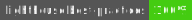

# Kristine S. Lorentzen

This is the repo for my CV, in the form of a web app. To view the site, visit [kristinesl.me](kristinesl.me). 

Technologies used:

- [TypeScript](https://github.com/Microsoft/TypeScript)
- [React](https://github.com/facebook/react)
- [Next.js](https://github.com/vercel/next.js)
- [Material UI](https://github.com/mui-org/material-ui) 
- [Emotion](https://github.com/emotion-js/emotion) & [Emotion icons](https://github.com/emotion-icons/emotion-icons)
- [Redux](https://github.com/reduxjs/react-redux)
- [FormatJS](https://github.com/formatjs/formatjs)
- [FlagKit](https://github.com/umidbekk/react-flag-kit)
